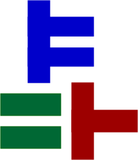
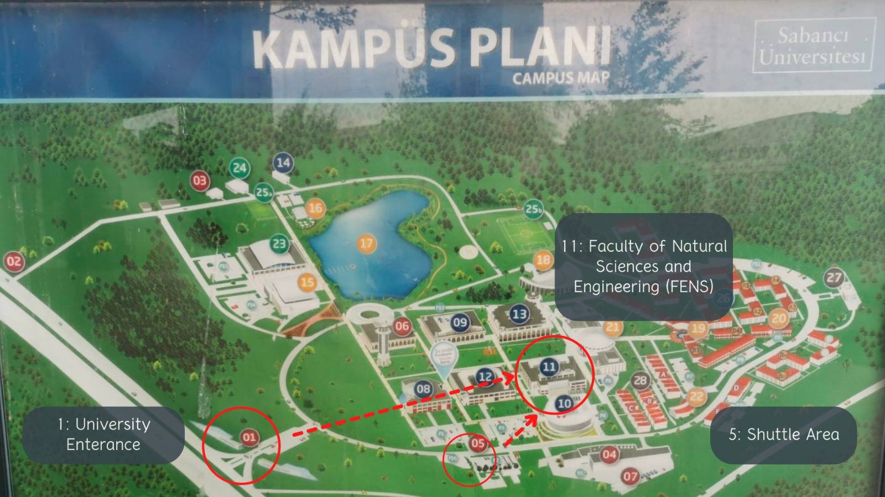

## Title: "Real World Coq -- An introduction to mechanically verified mathematical proofs"

Sept 5-9, 2022 | Sabanci University (SU), Istanbul

Instructor: Emilio J. Gallego Arias (Inria)
Coordinator: Süha Mutluergil (Sabanci University)

Duration of the course: 5 days

See the [attending the course](#Attending) section for more
information on attending.

This course has been financed by the COST Action
{:height="22px" width="22px"} ,
[EuroProofNet](https://europroofnet.github.io/)
{:height="22px" width="22px"} ,
supported by [COST (European Cooperation in Science and
Technology)](https://www.cost.eu)

## Introduction

Proofs constitute the backbone of both Mathematics and Computer
Science (CS). Doing a mathematical proof requires domain knowledge,
solid reasoning skills and applying reasoning techniques carefully
step-by-step. It is a tedious and error-prone task. For this reason,
computer scientists aim to develop programs for mechanizing and/or
automating the proof process. Coq is an interactive proof assistant
developed for this purpose. Using Coq, one can define mathematical
objects or computer programs, express theorems or assertions on these
entities, and mechanically check correctness of them by either
interacting with Coq or automatically by using so called proof tactics
depending on the availability of an applicable one.

[Coq](https://coq.inria.fr/) is an industrial-scale tool successfully
used for both research and commercial purposes. In 2005, famous four
color theorem was proven in Coq yielding a proof library as a by
product with general purpose features that could be used in many
settings. AbsInt company develops and maintains an optimized,
commercially used C compiler called CompCert. CompCert is specified,
programmed and verified in Coq, and its performance is comparable with
canonical GCC compiler.

Coq is a free open-source software developed and maintained by a large
and active [user community](https://coq.inria.fr/community.html). New
extensions and Coq based tools are frequently introduced.  It has a
[sub-reddit](https://www.reddit.com/r/Coq/) and active support can be
easily found on [Stack
Overflow](https://stackoverflow.com/questions/tagged/coq) and the new
[Stack Exchange](https://proofassistants.stackexchange.com/) for proof
assistants, the [Coq tag](https://stackexchange.com/questions/tagged/coq) is also useful.

Coq is mainly developed by Inria - French public computer science
institute. Its development and maintenance is managed by the [Coq
Team](https://coq.inria.fr/coq-team.html), but the development follows
a collaborative model and releases usually see dozens of external
contributors. Dr. Emilio Jesus Gallego Arias, the instructor for this
workshop, is a member of the core team.

This course aims to introduce Coq proof assistant through basic
concepts and various exercises. The course will be conducted by
Dr. Emilio Jesus Gallego Arias (primary instructor), a member of the
[Coq Core Team](https://coq.inria.fr/coq-team.html), The course will
consist of lectures including interactive and hands-on exercises. The
lectures will be conducted in English.

The first edition of the course will be held at Sabanci University,
Istanbul as a workshop between 5-9 September. Lectures will be
hybrid. The attendance is limited to 20 physical and 10 online
participants. Application information and further details on the
workshop is provided below.

## Schedule and Syllabus:

The course will take place using an intensive schedule, with 3 hours
in the morning for teaching, and 3 hours in the afternoon for
exercises (with the corresponding breaks).

Attendants are expected to follow the instructor along, as the lessons
themselves are interactive and allow the attendants to interact with
the Coq system.

See the references

### Day 1 (Sep 05th, 2022): Introduction to type theory as a mathematical language

We will review the formal logical language that is at the base of
interactive proof assistants such as Coq or Lean.

We will introduce the concept of "functional programming", which lies
at the root of the construction of Coq (or Lean) proofs, and review
some common patterns often used in the field.

#### Lesson links and schedule

|--------------|--------------------------------------------------|------------------------------------------------------------------------------------------------------------------------------------------------|
| Time         | Description                                      | Links                                                                                                                                          |
|--------------|--------------------------------------------------|------------------------------------------------------------------------------------------------------------------------------------------------|
| 08:40--10:10 | Welcome, introduction to the Coq Proof Assistant | [slides](https://x80.org/rwc/2022-sabanci/slides/coq-introduction.pdf)                                                                         |
| 10-10--10:40 | Break                                            |                                                                                                                                                |
| 10:40--12:10 | Type Theory as a Mathematical Language           | [html file](https://x80.org/rwc/2022-sabanci/code/lesson_1.html)                                                                               |
| 12:10--13:10 | Lunch                                            |                                                                                                                                                |
| 13:10--14:10 | Exercise Session I                               | [html file](https://x80.org/rwc/2022-sabanci/code/exercises_1.html) [solutions](https://x80.org/rwc/2022-sabanci/code/exercises_1_solved.html) |
| 14:10--14:30 | Break                                            |                                                                                                                                                |
| 14:30--15:30 | Exercise Session II                              |                                                                                                                                                |
|--------------|--------------------------------------------------|------------------------------------------------------------------------------------------------------------------------------------------------|

### Day 2 (Sep 06th, 2022): Core Coq tactics and proofs

We will introduce the Coq proof assistant more in depth, and
review how it is different from other programming languages.

We will discuss Coq datatypes ("inductive types"), which are a
powerful tool for the modelling of mathematical concepts, and we
will discover the main proof techniques, tactics, and library
objects available in Coq and the Mathematical components library.

We will place special focus on the role of libraries and modular
proofs.

#### Lesson links and schedule

|--------------|-----------------------------|------------------------------------------------------------------------------------------------------------------------------------------------|
| Time         | Description                 | Links                                                                                                                                          |
|--------------|-----------------------------|------------------------------------------------------------------------------------------------------------------------------------------------|
| 08:40--10:10 | Coq Core Tactics and Proofs | [html file](https://x80.org/rwc/2022-sabanci/code/lesson_2_1.html)                                                                             |
| 10-10--10:40 | Break                       |                                                                                                                                                |
| 10:40--12:10 | Structures and Libraries    | [html file](https://x80.org/rwc/2022-sabanci/code/lesson_2_2.html)                                                                             |
| 12:10--13:10 | Lunch                       |                                                                                                                                                |
| 13:10--14:10 | Exercise Session I          | [html file](https://x80.org/rwc/2022-sabanci/code/exercises_2.html) [solutions](https://x80.org/rwc/2022-sabanci/code/exercises_2_solved.html) |
| 14:10--14:30 | Break                       |                                                                                                                                                |
| 14:30--15:30 | Exercise Session II         |                                                                                                                                                |
|--------------|-----------------------------|------------------------------------------------------------------------------------------------------------------------------------------------|

### Day 3 (Sep 07th, 2022): Mathematics verification

In this session, we will discuss the proof style used to the
construction of proofs founds in the mathematics literature.

We will discuss libraries and proof techniques for (linear) algebra,
and group theory.

#### Lesson links and schedule

|--------------|--------------------------|---------------------------------------------------------------------|
| Time         | Description              | Links                                                               |
|--------------|--------------------------|---------------------------------------------------------------------|
| 08:40--10:10 | Mathematics verification | [html file](https://x80.org/rwc/2022-sabanci/code/lesson_3.html)    |
| 10-10--10:40 | Break                    |                                                                     |
| 10:40--12:10 | Mathematics verification |                                                                     |
| 12:10--13:10 | Lunch                    |                                                                     |
| 13:10--14:10 | Exercise Session I       | [html file](https://x80.org/rwc/2022-sabanci/code/exercises_3.html) |
| 14:10--14:30 | Break                    |                                                                     |
| 14:30--15:30 | Exercise Session II      |                                                                     |
|--------------|--------------------------|---------------------------------------------------------------------|

### Day 4 (Sep 08th, 2022): Program Verification

In this lecture, we will give an overview of the main techniques used
to verify the correctness of programs, including the definition of
custom program logics, and compiler correctness by simulation.

In this session, we will follow a proof style often found in the
programming language literature, which is a bit different from the one
used by mathematicians.

#### Lesson links and schedule

|--------------|----------------------|------------------------------------------------------------------|
| Time         | Description          | Links                                                            |
|--------------|----------------------|------------------------------------------------------------------|
| 08:40--10:10 | Program Verification | [html file](https://x80.org/rwc/2022-sabanci/code/lesson_4.html) |
| 10-10--10:40 | Break                |                                                                  |
| 10:40--12:10 | Program Verification |                                                                  |
| 12:10--13:10 | Lunch                |                                                                  |
| 13:10--14:10 | Exercise Session I   |                                                                  |
| 14:10--14:30 | Break                |                                                                  |
| 14:30--15:30 | Exercise Session II  |                                                                  |
|--------------|----------------------|------------------------------------------------------------------|

### Day 5 (Sep 09th, 2022): Advanced topics and Extended Exercise session.

We will briefly discuss some advances topics and trends in the area,
to proceed with an extended tutorial session to allow participants to
wrap their exercise sheets.

#### Lesson links and schedule

|--------------|----------------------|-------|
| Time         | Description          | Links |
|--------------|----------------------|-------|
| 08:40--10:40 | Advanced topics      |       |
| 10-40--11:10 | Break                |       |
| 11:10--12:10 | Exercise Session I   |       |
| 12:10--13:10 | Lunch                |       |
| 13:10--14:10 | Exercise Session II  |       |
| 14:10--14:30 | Break                |       |
| 14:30--15:30 | Exercise Session III |       |
|--------------|----------------------|-------|

## Attending

### Important Dates

Application Deadline: 31 August
Notifications: 1 September
Workshop: 5-9 September

### Registration

Only registered participants are allowed to attend the workshop. The
capacity is limited to 20 pyhsical, 10 online people. For registraion
(both online and physical), please fill the following
[form](https://forms.gle/amVNTKTNvemS73Ki6). Participants will be
picked by first come first served principle.

Registration is free for both online and physical
attendance. Unfortunately, no funding is available for transportation,
accommodation and food, not even for the students.

### Required Software

Each participant is expected to bring their own laptop. A laptop is
required as the course is interactive.

The course requires a recent version of the Chrome Web Browser. Other
browsers may work, but they are supported at your own risk.

Lessons will take place using the [jsCoq](https://coq.vercel.app/)
software. Please, click on the above link and **check the tutorial
works** on your computer.

Internet connection is much recommended but not required, let us know
if you can't connect to internet and we will find a way to distribute
the files.

### Location

**IMPORTANT UPDATE:**

Lectures will take place physically at

> Sabanci University, **FENS (Faculty of Engineering and Natural Sciences) L029**

everyday between 08.40 - 15.30.

Check [the campus map below](#campus map) for locating the room. In
this map, **FENS** is marked with number 11 and L029 is at the L (-1)
floor. Entrance through the FASS side (building number 12) is to the G
(0) floor and entrance through the cafeteria (building number 21) is
to the 1st floor. So, you have to go 1 floor down in the former case
and 2 floors down in the latter case. Then, you can locate the room
looking at the floor plans (basically L029 is at the corner with sides
looking to buildings 12 and 13).

.

### Course Forum

There is a [Course Forum](https://coq.zulipchat.com/#narrow/stream/341461-Sabanc.C4.B1-Coq-Course---Sept-2022)
hosted at Coq's Zulip.

### Transportation

The workshop will take place at SU Tuzla Campus. It is adjacent to
Istanbul Anadolu Highway (TEM, E-80) and 20 minutes drive away from
Sabiha Gokcen International Airport.

Transportation serviceses are mainly provided by shuttles of Gursel
Turizm. Shuttle schedule can be seen at
https://www.sabanciuniv.edu/en/shuttle-hours

Otherwise, IETT bus: KM18 can be taken, which has a stop directly
inside of Sabanci University.

Another alternative is taking a taxi from from Tavsantepe metro
station, which can be more costly but more comfortable as well.

Note that Gursel Shuttles also have departures from Pendik metro
station, which can be useful for those who want to use metro-shuttle
combination.

### Accommodation

There are no housing options inside Sabanci University
Campus. Unfortunately, the guesthouse will be closed for maintenance
during the workshop dates. Only in campus accommodation option for
workshop participants is student dormitories. 2-person rooms are
reserved for participants. Rates for staying single in the room is 800
try/night and sharing the room with another person is 400 try/night.

SU has a main cafeteria (Akkol) that serves breakfast (07:30 - 10:30),
lunch and dinner (11:30 - 20:30) at reasonable prices. In addition,
there are alternatives like Kucuk Ev, Subway, Pizza Bulls, Starbucks,
Piazza, Kopuklu Kahve and Fasshane inside the campus.

Unfortunately, no funding is available for reimbursing food and
accommodation expenses of participants.

### Online Participation

If you are registered for online participation, you can join us using
the following Zoom link: TBA

Recordings will be temporarily available here: TBA

## Contact

For your questions related to the organization, please email to [Suha
Mutluergil](mailto:suha.mutluergil@sabanciuniv.edu) or [Yagiz
Kilicarslan](mailto:ykilicarslan@sabanciuniv.edu).
